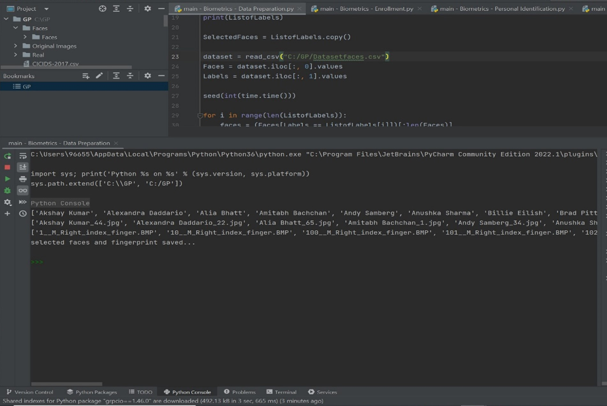
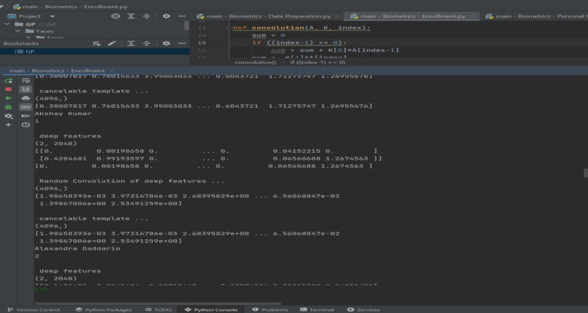
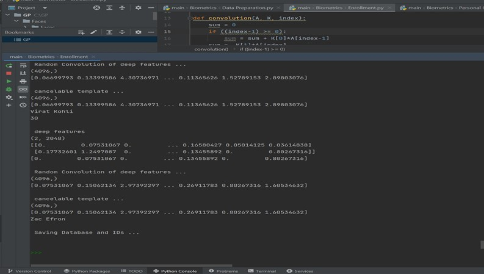

# Data preparation

```python
import time #timing measurements 
import numpy as np #data manipulation
from pandas import read_csv #reading data from a CSV file

#import random number generation
from random import seed #Sets a starting point for random number generation
from random import randint #Generates a random integer within a specified range

#Data Preparation Faces (list of labels for facial images)
ListofLabels = ['Akshay Kumar', 'Alexandra Daddario', 'Alia Bhatt', 'Amitabh Bachchan', ...]


#create a copy of ListofLabels and store it in SelectedFaces to keep track of which faces were chosen randomly
SelectedFaces = ListofLables.copy()
dataset = read_csv("/GP/Datasetfaces.csv")

Faces = dataset.iloc[:,0].values #Extracts image paths from the first column of the CSV and stores them in Faces
Lables = dataset.iloc[:,1].values #Extracts labels (corresponding to the images) from the second column of the CSV and stores them in Lables

seed(int(time.time())) #Sets the random number seed based on the current time, ensuring different random selections on different runs.


for i in range(len(ListofLabels)): #loop through each label (ListofLabels[i]) The goal is to randomly select one face for each label
  #Filters the Faces list based on the current label keeping only faces associated with that label.
  #Slices the filtered faces list to ensure it's the same length as the original Faces list (avoiding potential index errors)
  faces = (Faces[Labels == ListofLabels[i]])[:len(Faces)] 
  value = randint(0, len(faces)-1) #Generates a random integer within the range of available face indices (0 to len(faces)-1)
  SelectedFaces[i] = faces[value] #Updates the corresponding entry in SelectedFaces with the randomly chosen face path from the filtered faces list

print(SelectedFaces) #contains one randomly chosen face path for each label

#Saves the SelectedFaces list as (.npy file) This file will be used later in the enrollment and identification process.
filename = 'GP/selectedfaces.npy'
np.save(filename, SelectedFaces)


#Data preparation - fingerprints

#Read fingerprint data (paths or features) from a CSV file using pandas
dataset = read_csv("GP/Datasetfingerprints.csv")
Fingerprints = dataset.iloc[:,0].values #Extract fingerprints and labels from separate columns
Labels = dataset.iloc[:,1].values
print(len(Fingerprints))

seed(int(time.time()))

print(ListofLabels)

SelectedFingerprints = ListofLabels.copy() #Create a copy of ListofLabels for SelectedFingerprints


#loop through each label, filter fingerprints based on the label, randomly select one fingerprint per label, and update the SelectedFingerprints list
for i in range(len(ListofLabels)):
  fingerprints = (Fingerprints[Labels == ListofLabels[i]])[:len(Fingerprints)]
  value = randint(0, len(fingerprints)-1)
  SelectedFingerprints[i] = fingerprints[value]

#Print the final list of SelectedFingerprints
print(SelectedFingerprints)
filename = 'GP/selectedfingerprints.npy' #Save the SelectedFingerprints list as a NumPy array file "GP/selectedfingerprints.npy".
np.save(filename, SelectedFingerprints)
```
## Output
First line list of labels <br>
Second line list of faces pictures <br>
Third line fingerprint of the right index for each person <br>
it is organized the first fingerprint and the first face picture belong to the first person in the list of labels. <br><br>


<br><br>


# Enrollment 

```python
# Enrollment phase: Cancelable template generation from faces and fingerprints
# using Transfer learning (pretrained CNN as Feature Extractor) + Random Convolution

# numerical computations and array manipulations
import numpy
import numpy as np

# building and using deep learning models
import tensorflow 
from tensorflow import keras as ks

# definition of Random Convolution

RandomKernel = [1, 2, 1］# values for random convolution

# function named convolution that performs a basic 1D convolution operation at a specific index within an array A using a kernel K
def convolution(A, K, index):
  sum = 0
  if ((index-1) >= 0):
      sum = sum + K[0]*A[index-1]
  sum = K[1]*A[index]

  if ((index+1) <Len(A)):
    sum = sum + K[2]*A[index+1]
  return sum


# function named random_convolution that iterates over an array V and applies the convolution function at each element using the RandomKernel
# It returns a new array R with the convolved values
def random_convolution (V, Kernel):
  R = np. zeros (Len(V))
  for i in range (len(V)):
      R[i] = convolution(V, Kernel, i)
return R


# Data Preparation Loads a list of labels from ListofLabels
ListofLabels = ['Akshay Kumar', 'Alexandra Daddario', 'Alia Bhatt', 'Amitabh Bachchan', ...]

# Load pre-selected face and fingerprint paths from NumPy arrays (selectedfaces and selectedfingerprints).
filename = "GP/SelectedFaces.npy"
selectedfaces = np.load(filename)

filename = "GP/SelectedFingerprints.npy"
selectedfingerprints = np.load(filename)


# load the pre-trained model Resnet50 from TensorFlow's without dense layers
# (we don't need this classification capability. We simply need the deep features that the model has learned to represent the biometric data effectively)
resnet50_base = ks.applications.resnet50.ResNet50(weights="imagenet", include_top=False, input_shape=(224, 224, 3))
avg = ks.layers.GlobalAveragePooling2D()(resnet50_base.output)

# Creates a new model named resnet50_modelfs takes the input of the pre-trained ResNet50 and outputs the global average pooling features
resnet50_modelfs = ks.Model(inputs=resnet50_base.input, outputs=avg)
resnet50_modelfs.summary

print("\n Start processing data ... \n ")

# Initializes an empty NumPy array cancelabletemplates to store the generated templates
cancelabletemplates = np.array(())

# Iterates through each label in ListofLabels
for i in range(len(ListofLabels)):
  print（i）
  facefilename = "GP/Faces/Faces/" + selectedfaces[i] # Load the face and fingerprint image paths based on the current label and selected files
  imface = ks.preprocessing.image.load_img(facefilename)
  faceimage = ks.preprocessing.image.img_to_array(imface)
  fingerprintsfilename = "GP/Fingerprints/Real/" + selectedfingerprints[i]
  imfingerprint = ks.preprocessing.image.load_img(fingerprintsfilenane) # Load face and fingerprint images using keras.preprocessing.image functions
  fingerprint = ks.preprocessing.image.img_to_array(imfingerprint)
  faceimage = tensorflow.image.resize(faceimage, [224, 224]) # Resize both images to a standard size (224x224 px) using TensorFlow's image module
  fingerprint = tensorflow.image.resize(fingerprint, [224, 224])
  images_resized = np.array([faceimage, fingerprint]) # Combine the resized face and fingerprint images into a single array

  # Feature Extraction combined images using pretrained CNN - ResNet50 
  inputs = ks.applications.resnet50.preprocess_input(images_resized)
  Y_proba = resnet50_modelfs.predict(inputs) # Extract deep features from preprocessed images using the resnet50_modelfs model and store them in Y_proba
  deepfeatures = Y_proba

  print("\n deep features")
  print(deepfeatures.shape) # Print the shape of the deep features
  print(deepfeatures) # Print the deep features 

  # random projection of deepfeatures
  # Create a copy of the deep features and combine them into a single array X_new
  X = deepfeatures.copy() 
  X_new = numpy.append(X[0], X[1), axis=0)
  print (X_new)

  # Apply the random_convolution function on X_new using the RandomKernel to generate a randomly modified feature vector
  X_final = random_convolution (X_new, RandomKernel)

  # Print the shape and content of the randomly convolved features
  print("\n Random Convolution of deep features ...") 
  print(X_final.shape) 
  print("\n cancelable template ...")

  # Consider the current feature vector as the cancelable template, copy it to cancelabletemplate, and print its shape and content
  cancelabletemplate = X_final.copy() 
  print(X_final)
  print(cancelabletemplate.shape)
  print (cancelabletemplate)

  # Print the corresponding label from ListofLabels.
  print (ListofLabels[i])

# Depending on whether it's the first iteration (i == 0 cancelabletemplates is empty create a new NumPy array and insert the first user's cancelable
# template), or insert the current template at the specified index in the existing array(builds up an array containing all the cancelable templates for
# enrolled users).
  if i == 0:
      cancelabletemplates = np.array([cancelabletemplate])
  else:
      cancelabletemplates = np.insert(cancelabletemplates, i, cancelabletemplate, axis=0)


# save (cancelabletemplate + id) in securedDB
print("\n Saving Database and IDs ... \n")

# save two separate NumPy arrays
# Saves the cancelabletemplates array (containing all the generated cancelable templates) to the specified file using the np.save function from NumPy
filename = "GP/DB.npy"
np.save(filenane, cancelabletemplates)

# filename for saving the user labels (essentially IDs).
# Saves the ListofLabels (containing the list of labels/names associated with each user) to the specified file using np.save
filename = "GP/IDs.npy" 
np. save(filename, ListofLabels)

```
## Output
1. we have the deep features extraction
2. then the random convolution of deep features
3. then we have the cancelable template and the name of each person and their ID
4. at the end it will be Saved in “DB” file and “IDs” file.
<br><br>
<br>
<br>
<br>


# Personal identification 

```python
# identification phase: Cancelable template using Transfen learning (pretrained CNN as Feature Extracton)

impont numpy
import tensorflow
import time
from tensorflow import keras as ks
import numpy as np
import matplotlib.pyplot as plt
from sklearn import random_projection
from pandas import read_csv
from numpy.linalg import norm

#Impont Randon Number Generation
from random import seed
from random import randint


# definition of Random Convolution with a kernel of size 3
Randomkernel = [1, 2, 1]

def convolution(A, K, index):
    Sum = 0
    if ((index-1) >= 0):
        sum = sum + K[0)*A[index-1]
    sum = K[1]*A[index]
    if ((index+1)<len(A)):
        sum = sum + K[2]*A[index+1]
    return sum


def random_convolution(V, Kernel):
    R = np.zeros(len(V))
    for i in range(len(V)):
        R[i] = convolution(V, Kernel, i)
    return R


# set the seed of random generator
seed(int(time.time()))


# Load secured DB and IDs
ListofLabels = ['Akshay Kumar', 'Alexandra Daddario', 'Alia Bhatt', 'Amitabh Bachchan', ...]

filename = "GP/DB.npy"
DB = np.load(filename)

filename = "GP/IDs.npy"
IDs = np.load(filename)


# Load datasets
dataset1 = read_csv("6P/Datasetfaces.csv")
Faces = dataset1.iloc[:, 0].values
LabelsFaces = dataset1.iloc[:, 1].values


dataset2 = read_csv("GP/Datasetfingenpints.csv")
Fingerprints = dataset2.iloc[:, 0]. values
LabelsFingerprints = dataset2.iloc[:, 1].values


# load the model
# Resnet58 without dense layers ... including GlobalAveragePooLing20() layer -> 2048 features
resnet50_base = ks.applications.resnet50.ResNet50(weights="imagenet", include_top=False, input_shape= (224, 224, 3))
avg = ks.layers.GlobalAveragePooling2D()(resnet50_base.output)
resnet50_modelfs = ks.Model(inputs=resnet50_base.input, outputs=avg)
resnet50_modelfs.summary()

print(" \n Start processing data ... \n ")

# select randomly a person
value = randint(0, len(ListofLabels)-1)
Person = ListofLabels[value]

print (Person)

# select randomly one case (face + fingerprints) from datasets

faces = (Faces[LabelsFaces == Person])[:len(Faces)]
value = randint(0, len(faces)-1)
SelectedFace = faces[value]

print(SelectedFace)

fingerprints = (Fingerprints[LabelsFingerprints == Person])[:len(Fingerprints)]
value = randint(0, len(fingerprints)-1)
SelectedFingerprints = fingerprints [value]

print (SelectedFingerprints)


# generate cancelable template
facefilename = "GP/Faces/Faces/" + SelectedFace
imface = ks.preprocessing.image.load_img(facefilename)
faceimage = ks.preprocessing.image.img_to_array(imface)
fingerprintsfilename = "GP/Real/" + SelectedFingerprints
imfingerprint = ks.preprocessing.image.load_img(fingerprintsfilename)
fingerprint = ks.preprocessing.image.img_to_array(imfingerprint)
faceimage = tensorflow.image.resize(faceimage, [224, 224])
fingerprint = tensorflow.image.resize(fingerprint, [224, 224])
images_resized = np.array([faceimage, fingerprint])


# Feature Extraction using pretrained CNN - ResNet50
inputs = ks.applications.resnet50.preprocess_input(images_resized)
Y_proba = resnet50_modelfs.predict(inputs)
deepfeatures = Y_proba
print("\n deep features")
print (deepfeatures.shape)
print (deepfeatures)


# random projection of deepfeatures
X = deepfeatures.copy()
X_new = numpy.append(X[0], X[1), axis=0)
print(X_new)
X_final = randon_convolution(X_new, RandomKernel)

print("\n in Randon Convolution of deep features ...")
print(X_final.shape)
print(X_final)
print("\n cancelable template ...")

cancelabletemplate = X_final.copy()
print("cancelable template + Person ...")
print(cancelabletemplate.shape)
print(cancelabletemplate)
print(Person)
print("\n")


# matching using Euclidean Distance between Cancelable template and DB ...
print ("matching process")
index = 0
mindist = norm(DB[0]-cancelabletemplate)

for i in range(len(DB)):
    dist = norm (DB[i]-cancelabletemplate)
    print (DB[i])
    print (dist)
    if (dist < mindist):
        mindist = dist
        index = 1

print(IDs[index])
print (mindist)
```
## Output


# Evaluation 

```python


```
## Output
