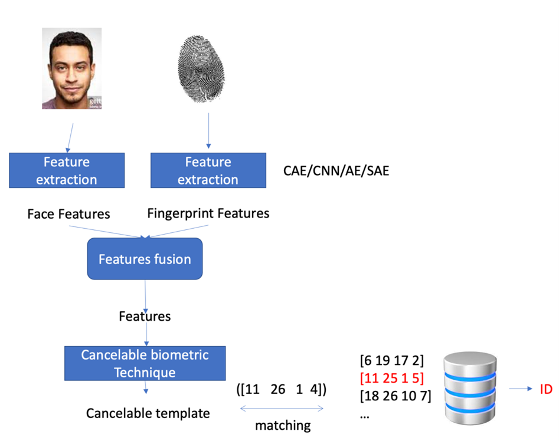
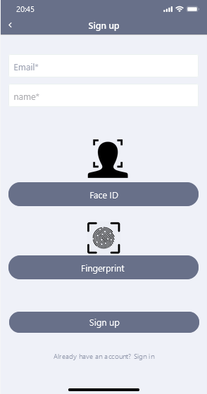
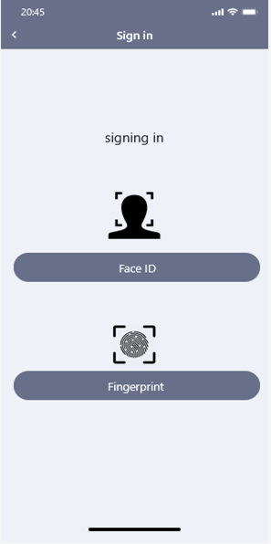
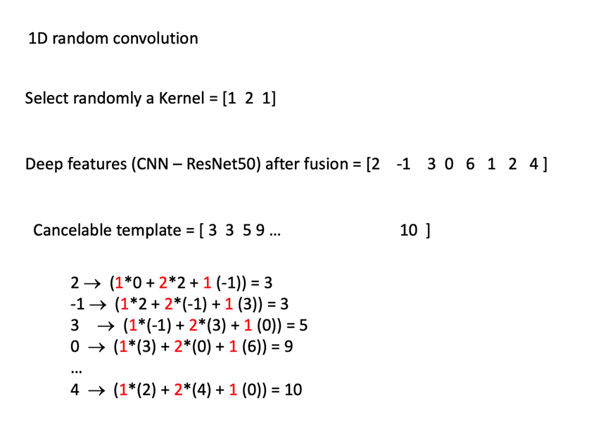

# Personal Identification System with Deep Learning and Cancelable Biometrics summary

**Abstract**

This report details a personal identification system that uses deep learning and cancelable biometrics to enhance security and user experience. The system replaces password-based authentication, offering a more robust and convenient solution for remote access scenarios, such as online banking.
The general architecture of our system  
   

**1. Introduction**

Traditional password-based authentication systems are vulnerable to security breaches. This project addresses this concern by proposing a system that utilizes deep learning for feature extraction and cancelable biometrics to ensure data privacy. Biometric features, like fingerprints and facial recognition, provide a more secure alternative to passwords due to their unique nature.

**1.1 Biometrics and Cancelable Biometrics**

**Biometrics** refers to the measurement and analysis of physical or behavioral characteristics for identification purposes. Common examples include fingerprints, iris scans, and facial recognition.  

**Cancelable biometrics** a transformation process on captured biometric data to generate a template. This template serves for identification purposes but cannot be reversed to recover the original data. This limits security risks if the database containing templates is compromised.

**1.2 Deep Learning**

**Deep learning** is a subfield of machine learning that uses artificial neural networks. It excels at pattern recognition and feature extraction from data, making it ideal for biometric identification tasks.

**2. Related Work**

Existing research explores various techniques for secure biometric authentication using deep learning and cancelable biometrics.  
These studies demonstrate the feasibility and potential benefits of the proposed system.

**3. System Analysis**

**3.1 Requirements**

  **Functional Requirements:**
   * Enrollment (Sign Up): Users register their biometric data (face and fingerprint) along with personal information.
   * System Management: Admins control user accounts and system configurations.
   * Personal Identification (Sign In): Users access the system using enrolled biometrics.
        
  **Non-Functional Requirements:**
   * Availability: The system should be accessible to authorized users most of the time.
   * Security: Biometric data must be protected using cancelable templates.
   * Reliability: The system should consistently perform accurate identifications.
   * Efficiency: The identification process should be fast and responsive.

**3.2 Software and Hardware**

**Software:**
* Operating System: Windows OS 
* Programming Language: Python with TensorFlow 2.0 and Keras
        
**Hardware:**
* Laptop with a Graphics Processing Unit (GPU) (RTX 3070 or RTX 3080 TI)
* Smartphone for capturing biometric data (face and fingerprint)

**4. System Design**

**4.1 System Architecture**

**The system consists of two primary phases:**

  Enrollment Phase (Sign Up):
        Users provide their email, name, face image, and fingerprint scan.
        The system extracts features from the biometric data using a deep learning model.
        A cancelable template is generated by applying a transformation function (random convolution) to the extracted features.
        User information and the cancelable template are stored securely in a database.  
   

  Identification Phase (Sign In):
        Users attempt to access the system by providing their face and fingerprint.
        The system captures the live biometric data.
        Deep learning models extract features from the captured data.
        The extracted features undergo the same transformation function used during enrollment (random convolution).
        The transformed features (templates) are compared with those stored in the database using Euclidean distance(the straight-line distance between two points).
        If a match is found within a predefined threshold, the user is granted access. Otherwise, access is denied.  
    
 
**4.2 Interfaces**

* Main Interface: Presents the user with sign-in and sign-up options.  
   

  
* Sign Up Interface: Allows users to enter their information and capture biometric data.  
   

  
* Sign In Interface: Captures live biometric data for identification.  
   

  

**4.3 Datasets**

We used publicly available datasets from Kaggle the Face Recognition Dataset, for training and testing the deep learning models.

**5. Implementation**

**5.1 Implementation Requirements**

  Software: Python (PyCharm), TensorFlow 2.0, Keras  
  Hardware: Laptop with GPU (RTX 3070 or RTX 3080 TI), Smartphone

**5.2 Implementation Details**

  **Data Preparation:**
   This phase selects one random face image and fingerprint for each person from the dataset. These are used in the enrollment phase to build the database.

  **Enrollment Method:**
  * Using 1D random convolution (1 dimension)
   The selected facial images and fingerprints are used to generate a cancelable template for each person.

   Deep features are extracted from both face and fingerprint using a pre-trained CNN (ResNet50). 
   
   Instead of simply combining the features directly, the system applies a random convolution operation. This involves applying a filter(Kernal) with random weights to each set of deep features (face and fingerprint) separately performing calculations to modify them. The random weights act like a secret code that scrambles the information in a controlled way.

These deep features are then merged, creating a unique cancelable template.

The generated template is stored in the database for future identification.
  
   

  **Personal Identification:**
    During sign-in, a random face image and fingerprint are selected for a specific person.
    Similar to enrollment, deep features are extracted from the captured data using ResNet50.
    Random convolution is applied, and the resulting features are compared to the stored templates in the database using Euclidean distance(the straight-line distance between two points).
    The person with the closest template (smallest distance) is identified as the user attempting to access the system.

  **Evaluation:**
    The system's performance is evaluated by calculating identification accuracy with different numbers of face and fingerprint images per person (5, 10, 15, 20, 25, 30). This helps determine the optimal number of samples for reliable identification.

**5.3 I/O Screens**

  **Data Preparation:**
        Input: Dataset containing face and fingerprint images.
        Output: A list of labels , followed by corresponding face image paths and fingerprint paths.

  **Enrollment:**
        Input: "SelectedFaces" and "SelectedFingerprints" files generated by data preparation.
        Output: Deep features, randomly convoluted features, and the final cancelable template for each person. This information is saved in the "DB" file, while user IDs are saved in the "IDs" file.

  **Personal Identification:**
        Input: "DB" and "IDs" files containing stored templates and user IDs.
        Output: The system processes data for a randomly chosen user (face image and fingerprint), performs feature extraction and convolution, generates the cancelable template, and compares it to stored templates. Finally, it displays the identified user's name.

  **Evaluation:**
        Input: "DB" and "IDs" files, along with "DatasetFaces" and "DatasetFingerprints" (containing all data for evaluation).
        Output: The code calculates accuracy based on correctly identified users compared to the total number of attempts across multiple repetitions (e.g., 30 repeats). Higher accuracy indicates better system performance.

**6. Testing**

**6.1 Test Plan**

  Test Objective: Evaluate system accuracy, a common metric for supervised learning systems.
  Test Approach: We will conduct six test cases with varying numbers of repeats (5, 10, 15, 20, 25, 30) to assess accuracy and identify the optimal number for reliable identification.

**6.2 Test Cases**

Five randomly chosen test cases will be executed to ensure the system consistently produces accurate results. Each run will involve random selection of data and independent identification attempts.

**7. Conclusion**

**7.1 Evaluation**

This project explored the application of deep learning and cancelable biometrics for secure personal identification. The system utilizes two modalities (face and fingerprint) to enhance security. By employing random convolution on deep features, cancelable templates are generated, protecting user privacy even if the database is compromised. The project achieved its primary goals of increased security and reliable identification through the proposed approach.

**7.2 Future Work**

Explore the potential of deeper learning architectures for more robust feature extraction.
Test the system on a larger and more diverse dataset containing noisy samples to assess its generalizability and robustness in real-world scenarios.
Investigate additional biometric modalities (e.g., iris recognition) for further security enhancement.

By incorporating these future endeavors, the system's performance and adaptability can be further improved.
